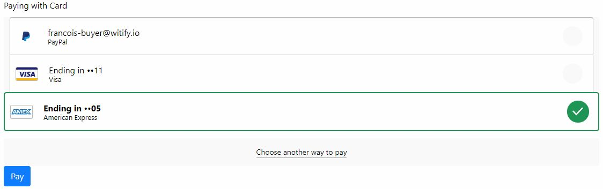

# Vue Braintree

<p>
    <a href="https://codeclimate.com/github/francoislevesque/vue-braintree/maintainability"></a>
    <a href="https://codeclimate.com/github/francoislevesque/vue-braintree/test_coverage"></a>
    <a href="https://travis-ci.org/francoislevesque/vue-braintree"></a>
</p>



## Quick start
Install the package
``` js
npm i vue-braintree -S
yarn add vue-braintree
```
Import and use the package
``` js
import VueBraintree from 'vue-braintree'
Vue.use(VueBraintree)

<v-braintree :token="token" :paypal="true"></v-braintree>
```

## Documentation

### Behavior

Once a payment is successfully made, the component stays in a frozen state until it's destroyed.

### Props

Prop | Description | Default |
--- | --- | --- |
token | The client token generated from the server | - |
paypal | Include PayPal vault | `false` |
locale | The desired locale (<a href="https://github.com/braintree/braintree-web-drop-in/tree/master/src/translations">available locales</a>) | `en_US` |
url | URL on which the nonce is send | `/pay` |
btnText | The text of the button | 'Pay' |
btnClass | The class of the button | 'btn btn-primary' |

### Events

Event | When | Payload
--- | --- | ---
loaded | The drop in has loaded | -
success | The transaction was successful | -
success | The transaction was failed | Error message (string)

## Build Setup

``` bash
# install dependencies
npm i

# build for production with minification
npm run build

# run unit tests
npm test

# run unit tests with hot reload
npm run watch
```
